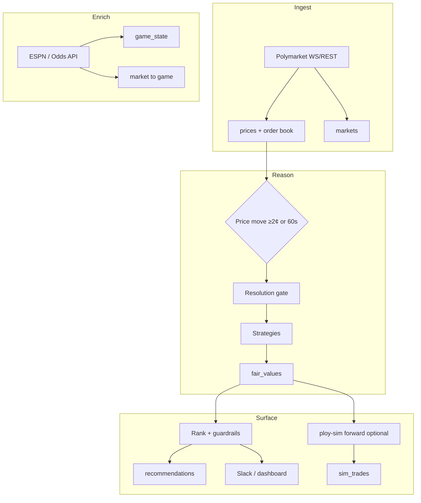

# How PloyAgent Works

NBA (and other) Polymarket edge-detection agent. It **does not place trades** — it surfaces ranked recommendations (and optional paper-trading simulation) from live market data and statistical models.

---

## Big picture

Independent Python services share **TimescaleDB** only (no message broker):

```
Polymarket WS/REST  →  ingest   →  prices, order books, markets
ESPN / Odds API     →  enrich   →  game_state, market→game mapping
Reasoning loop      →  reason   →  fair_values (per strategy)
Notifier            →  notify   →  recommendations (+ Slack optional)
Web dashboard       →  web      →  read-only UI
Sim (optional)      →  ploy-sim →  paper trades across threshold profiles
```

**Invariant:** No automated trade execution on Polymarket. Humans (or your own process) decide whether to act.

---

## Pipeline overview



---

## 1. Logic: when does the agent “think”?

### Ingest (`ploy-ingest`)

- Subscribes to Polymarket WebSocket; maintains an in-memory L2 book per market.
- Writes **prices** (mid, depth, spread) and discovers markets via Gamma tags / event slugs (`POLY_GAMMA_TAGS`, `POLY_GAMMA_EVENT_SLUGS`).

### Enrich (`ploy-enrich`)

- Polls ESPN (or Odds API) for scores, clock, possession, etc.
- Maps markets → games (`market_game_map`).

### Reason (`ploy-reason`) — core edge logic

For each open market, re-evaluation triggers when:

- Price moved **≥ 2¢** since last check, **or**
- **60 seconds** have passed (whichever comes first)

Then, in order:

1. **Resolution gate** — Is the market’s resolution wording safe? (regex heuristics + optional LLM). Ambiguous criteria (“according to Twitter”, etc.) → market is **dropped** and never recommended.

2. **Strategies** (from `AGENT_STRATEGIES`) each output:
   - `model_prob` — fair YES probability (from stats/rules, **not** from the LLM)
   - `market_prob` — current market mid
   - `edge_cents` = `(model_prob - market_prob) × 100`
   - `confidence` — how trustworthy the signal is (0–1)
   - `reasoning` — human-readable narrative

3. Results stored in **`fair_values`** (one row per strategy × market × time).

### Claude / LLM role

The LLM produces **confidence + narrative only**, not game probabilities. If `ANTHROPIC_API_KEY` is unset, a statistical fallback (~0.55 confidence) is used.

Game probabilities come from strategies (e.g. logistic regression on score diff + time remaining for NBA).

### Strategy auto-disable

Strategies with **≥ 10 resolved** recommendations in the last **7 days** and **negative total P&L** are skipped in reasoning until performance recovers.

### Available strategies (enable via `AGENT_STRATEGIES`)

| ID | Description |
|----|-------------|
| `baseline_model` | Logistic regression on score diff, time remaining, possession |
| `stale_quote` | Quote hasn’t moved despite game state change |
| `sportsbook_consensus` | Devigged sharp-book lines (needs Odds API) |
| `cross_market_arb` | Complementary markets that don’t sum to ~1.0 |
| `behavior_fade` | Fades short-window price spikes |
| `player_adjust` | Adjusts for key player foul/injury signals |

---

## 2. Scoring: how picks are ranked

Ranking runs in the notifier (`top_picks` + filters).

### Edge (direction)

```
edge_cents = (model_prob - market_prob) × 100
```

| Edge | Meaning |
|------|---------|
| **> 0** | **BUY YES** — model says YES is cheap vs market |
| **< 0** | **SELL YES** (bet NO) — model says YES is expensive |

Default floor: **`MIN_EDGE_CENTS`** (typically 5¢ — covers ~2% fee + spread).

### Stale-signal decay

Fair values age quickly. Before scoring:

```
effective_edge = edge_cents × decay_factor(age)
```

Exponential decay with **~3 minute half-life**. Old signals contribute less to the composite score.

### Composite score

```
score = |effective_edge|
      × log(1 + depth_1c)
      × confidence
      × time_factor
      × risk_reward_factor
```

| Factor | Role |
|--------|------|
| `log(1 + depth_1c)` | Prefer liquid books (size within 1¢ of mid) |
| `confidence` | 0–1 from LLM or statistical fallback |
| `time_factor` | `1 / (1 + hours_to_resolution)` — sooner resolution → higher score |
| `risk_reward_factor` | Penalizes extreme prices (e.g. buying YES at 85¢) |

**Kelly fraction** may be computed for display; it does **not** auto-size real bets.

### Merge by market

If `RANK_MERGE_BY_MARKET=true`, only the **best-scoring strategy** per market is kept before taking top N (`RANK_TOP_N`, default 5).

---

## 3. Policies: what gets filtered out

Signals can be dropped at multiple layers.

### A) Resolution gate (reasoning)

Mandatory. Unsafe resolution criteria → no recommendations for that market.

### B) Phase 1 guardrails (ranking)

| Policy | Typical default | Rule |
|--------|-----------------|------|
| Entry price band | `ENTRY_PRICE_MIN=0.35`, `ENTRY_PRICE_MAX=0.65` | Market mid must be in range |
| Min risk/reward | `MIN_RISK_REWARD=0.30` | Risk/reward factor must be ≥ threshold |

Avoids lottery-ticket odds and poor payoff geometry.

### C) Adaptive edge (alerts)

Uses **resolved recommendations over the last 3 days**:

- Hit rate **≥ 60%** → tighten min edge (trade more when hot)
- Hit rate **≤ 40%** → widen min edge (pickier when cold)
- Otherwise → use `MIN_EDGE_CENTS`

Used when `ALERT_MIN_EDGE=0` (adaptive mode).

### D) Alert filters (notifier)

After ranking, picks may need:

- `|edge| ≥ alert_min_edge` (or adaptive)
- `depth_1c ≥ ALERT_MIN_DEPTH`
- `score ≥ ALERT_MIN_SCORE`

### E) Dedup / cooldown

Won’t spam duplicate recommendations for the same market/strategy if one is already **pending** within a short window (~15 minutes). Slack can update a single live feed message.

### F) Auto-approve

`AUTO_APPROVE_RECS=true` (common default) marks new rows **approved** for P&L tracking — still **no** automatic Polymarket orders.

### G) Strategy auto-disable

Losing strategies (7-day resolved P&L < 0, ≥10 samples) stop producing new evaluations.

---

## 4. Notifier & dashboard

Every few seconds (`ploy-notify`):

1. `top_picks` with guardrails
2. Adaptive edge + alert filters
3. Insert **`recommendations`** (status: pending / approved / rejected)
4. Optional Slack with Approve/Reject buttons (`ploy-slack-events` on port 8766)
5. Resolve P&L when markets settle (for approved recs)

Web dashboard (`ploy-web`, port 8765) reads the same tables.

---

## 5. Simulation (optional, separate policies)

**Paper trading** does not change live recommendations. `ploy-sim forward` reads the same ranked picks and applies many **threshold profiles** (grid of min edge × confidence × min model probability).

| Gate | BUY | SELL |
|------|-----|------|
| Edge | ≥ `min_edge_cents` | ≤ `-min_edge_cents` |
| Confidence | ≥ `min_confidence` | same |
| Model prob | `model_prob ≥ min` | `(1 - model_prob) ≥ min` |

**Exits:** market resolution, reverse signal, or max hold time.

Useful for comparing “what if we required 8¢ edge and 0.65 confidence?” without risking capital.

---

## 6. Key environment variables

| Variable | Purpose |
|----------|---------|
| `DATABASE_URL` | TimescaleDB connection |
| `POLY_GAMMA_TAGS`, `POLY_GAMMA_EVENT_SLUGS` | Which markets to track |
| `AGENT_STRATEGIES` | Comma-separated strategy IDs |
| `MIN_EDGE_CENTS` | Minimum edge to consider |
| `ENTRY_PRICE_MIN`, `ENTRY_PRICE_MAX` | Allowed market mid range |
| `MIN_RISK_REWARD` | Minimum risk/reward factor |
| `RANK_TOP_N` | Recommendations per notifier tick |
| `ANTHROPIC_API_KEY` | LLM confidence (optional) |
| `SLACK_BOT_TOKEN`, `SLACK_CHANNEL` | Slack alerts (optional) |
| `AUTO_APPROVE_RECS` | Auto-mark recommendations approved |

Same logic runs locally and on AWS; only config and deployment differ.

---

## One-sentence summary

**Strategies estimate fair vs market → scoring ranks by edge × liquidity × confidence × time × risk/reward → policies drop unsafe, illiquid, extreme, stale, or historically losing signals → top rows become recommendations (and optional sim paper trades).**

---

## Services to run (local dev)

```bash
docker compose -f infra/docker-compose.yml up -d   # TimescaleDB
ploy-migrate
ploy-ingest
ploy-enrich
ploy-reason
ploy-notify
ploy-web    # http://127.0.0.1:8765
# optional:
ploy-slack-events   # port 8766
ploy-sim forward    # paper trading
```

See `CLAUDE.md` and `docs/aws-hosting.md` in the repo for full setup and production deployment.
